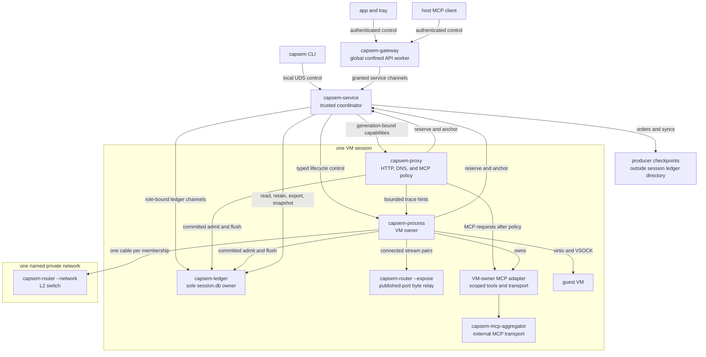
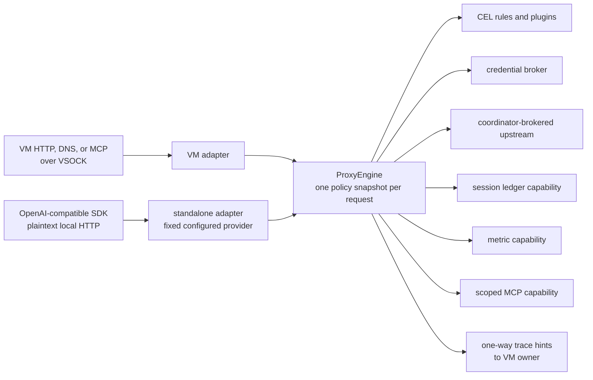

Capsem does not treat every process running as the desktop user as equally
trusted. The service is the trusted coordinator. It creates resources, selects
policy, and grants already-open descriptors to small workers whose operating
system sandbox limits what they can do after startup.

This page describes the host boundary. [Virtualization Security](/security/virtualization/)
describes the guest boundary, and [Network Isolation](/security/network-isolation/)
describes packet paths inside a VM.

## Ownership model



There is one `capsem-process`, `capsem-proxy`, and `capsem-ledger` generation
per running VM session. A stopped retained session has no VM owner or proxy;
the service starts or reconnects its ledger worker when a read or maintenance
operation needs the retained ledger. Standalone model-proxy sessions have a
proxy and ledger but no VM owner. Each named private network has one switch
process. Each running VM with published ports has one publication relay.

Libraries do not add process boundaries. `capsem-core`, `capsem-logger`, and
the Rust SDK hold shared types and behavior inside the binaries above. Tokio
tasks and worker threads share their process sandbox.

## Three kinds of traffic

Keeping the paths separate prevents a data connection from becoming control
authority.

| Path | Examples | Authority |
|---|---|---|
| Control | client API, service-to-owner IPC, worker grant frames, policy reload | Typed and bounded messages; fresh process generation required |
| Private data plane | VSOCK, private-network frames, published-port byte streams | Connected descriptors for one session, network membership, or flow |
| Proxied traffic | HTTP, DNS, model API, framed guest MCP | A descriptor granted to the session proxy plus separate upstream, policy, credential, ledger, telemetry, and trace-hint capabilities |

A worker does not receive a path and then reopen the resource. The coordinator
opens or accepts the resource, creates a connected channel, attaches the file
descriptor to a fixed-size control record, and waits for the current worker
generation to adopt it. Unknown, duplicated, stale, oversized, or out-of-order
grants fail closed.

## Process authority

| Process | Permitted after readiness | Denied or absent |
|---|---|---|
| `capsem-service` | Global lifecycle, settings and corp policy, credential store, MCP discovery catalog, session registry, resource creation and capability grants, including exact loopback publication listeners; producer ordering and external commitment checkpoints | It is part of the trusted computing base; clients reach it through the local UDS or authenticated gateway routes |
| `capsem-gateway` | Accept on listeners bound before confinement; use coordinator-granted service/owner channels; update its private readiness files | Ambient file reads, path-based UDS connects, outbound TCP, new binds, process execution |
| `capsem-process` | One VM and its exact session runtime paths; read exact boot assets and initial active policy; receive policy reload bytes and use upstream, loopback-listener, and ledger capabilities granted by the coordinator; execute only the installed router helper | Other sessions, the global MCP discovery catalog, direct `session.db` access, ambient outbound connects/binds, unrelated host files and processes |
| `capsem-proxy` | Consume granted HTTP, DNS, MCP, upstream, credential, ledger, metrics, private-name, policy, and one-way trace-hint channels | All filesystem access, arbitrary dial/bind/listen and control-socket access, process execution, signals to the coordinator |
| `capsem-ledger` | Read and write one session directory; serve authenticated operations over granted connected channels | Other paths, ambient network and control-socket access, process execution, signals to the coordinator |
| `capsem-router --expose` | Copy bytes between connected host TCP and guest VSOCK descriptors | Listener ownership, destination selection, filesystem, arbitrary network, VM control |
| `capsem-router --network` | Switch frames among the descriptor-backed cables of one named network | Uplink, listener, outbound socket, another network's members, policy decisions |
| `capsem-mcp-aggregator` | Connect to configured external MCP servers and return protocol results | VM control, session files, ledger storage, service API; requests arrive only after the session policy boundary |

The gateway, VM owner, proxy, and ledger install a platform sandbox and perform
negative self-checks before publishing readiness. A startup that can still read
an ambient host file, dial a path-owned control socket, execute an ungranted
program, or signal its coordinator is rejected.

## Platform enforcement

On macOS, workers install Seatbelt profiles. Proxy and ledger workers use
`deny default`; the proxy has no path parameters, and the ledger receives one
read-write session directory. Gateway and VM-owner profiles deny filesystem,
network, execution, and cross-sandbox signal operations, then add their exact
path grants. The gateway accepts only on listeners it already owns. A VM owner
accepts only on an exact loopback listener granted over its generation-bound
coordinator channel; it cannot create or bind another network socket.

On Linux, workers support Landlock ABI 6 and newer. ABI 8 adds synchronized
restriction of existing threads. On ABI 6 and 7, startup remains
single-threaded until Landlock is installed; every later runtime, hypervisor,
database, monitor, logging, and parent-watch thread inherits that domain. A
worker refuses startup if an older ABI already has a sibling thread. Seccomp
is installed with thread synchronization after the Landlock ruleset. Landlock
limits filesystem scope; seccomp denies direct socket creation, connect, bind,
listen, process inspection, namespace and mount operations, kernel attack
surfaces, and permission or ownership changes. On macOS, Seatbelt denies
external bind, listen and connect operations but permits private unnamed Unix
socketpairs, which carry no filesystem or network destination authority. Proxy
and ledger workers cannot send signals on either platform. Existing connected
descriptors remain usable because they are the capability.

A writable Landlock path does not carry device-ioctl authority. The VM owner
receives that authority only for the exact `/dev/kvm` and `/dev/vhost-vsock`
device nodes it needs. A regular file is rejected if code tries to grant it the
device class, so widening an ordinary writable path cannot also widen KVM or
VSOCK control.

The VM owner prepares only resources that cannot be acquired after the
sandbox: its inherited coordinator channel, exact IPC listeners, readiness and
log files, metric channel, Linux AF_VSOCK listeners, `/dev/null` for the router's
closed output streams, and saved publication state. Publication state is
materialized and migrated before confinement; the
confined publisher consumes that prepared state without reopening the session
root. Updates create private files at their final mode and need no later
permission change. When that publisher opens or restores a port, the
coordinator binds the exact `127.0.0.1` listener and passes its descriptor to
the owner. The owner validates the descriptor address before admission and
acceptance. Host TCP streams are armed for reset on close before handoff; on
Linux, abnormal cleanup closes the owner and confined-router copies with that
setting still armed instead of restoring a direct `connect` syscall. The
service never accepts a publication connection or reads its workload bytes.
Before confinement, the owner asks the coordinator for its ledger
capability. The grant arrives only after `capsem-ledger` has initialized
`session.db`; the owner keeps the connected descriptors, installs its sandbox,
and verifies that opening that existing database by path is denied. It then
starts the parent watcher, hypervisor, ledger client, filesystem monitor,
metric exporter, and VM workers. KVM opens only its explicitly granted device
nodes and consumes the prepared VSOCK descriptors after confinement; it does
not regain general device-ioctl, `socket`, or `bind` authority.

Both platforms clear inherited environment state where secrets could otherwise
leak and close descriptors that were not deliberately preserved. The sandbox
is additive to normal ownership and mode checks; mode `0600` sockets and mode
`0700` session directories remain in use.

The proxy keeps request correlation without retaining trace environment
variables. After clearing its environment, it derives a compact process trace
identity from the coordinator-minted worker generation passed on the command
line. Model tool calls that name workspace files cross a separate fixed-size
channel to the VM owner. The owner validates each relative path, installs the
hint in the filesystem monitor's bounded correlation table, and acknowledges
it before the model response completes. That channel grants the proxy no
workspace descriptor or read authority; malformed, escaping, or oversized
hints close it.

The VM owner opens the workspace as a contained directory before confinement
and carries that descriptor across the boundary. It never reopens the broader
session directory, which also contains the ledger. If the filesystem monitor
cannot start from the contained descriptor, VM startup fails instead of
running without filesystem audit coverage.

## Shared proxy engine

VM interception and the standalone model API are transport adapters around the
same `ProxyEngine`.



The engine owns request normalization, policy evaluation, preprocessing and
postprocessing, credential capture/substitution, model and tool parsing,
redaction, and ledger emission. A request keeps one immutable policy snapshot
through routing and completion. Policy reload atomically replaces the snapshot
used by later requests.

The VM adapter accepts intercepted TLS/plain HTTP, DNS, and framed MCP traffic.
The standalone adapter accepts only origin-form OpenAI-compatible HTTP and pins
the host, port, scheme, and base path to the selected provider from effective
policy. It rejects `CONNECT` and absolute-form forward-proxy requests.

MCP sits above the SDK/model protocol layer. Model-native tool calls are parsed
and logged by the shared engine. Guest MCP frames enter the same security-event
rail before a scoped request reaches the MCP aggregator. A model call may emit
many tool calls, and later model requests can carry their responses; the ledger
links them with `turn_id`, `model_call_id`, and `tool_call_id`.

## Ledger ownership

`capsem-ledger` is the only process that opens `session.db` and its body
archive. A connected channel carries a generation and a coordinator-assigned
role:

| Role | Operations |
|---|---|
| VM owner, proxy, coordinator | Admit events and flush |
| Reader | Read and export |
| Maintainer | Read, retain, export, and take a coherent snapshot |
| Supervisor | Shutdown |

The VM owner and proxy use `DbWriter` as a remote typed client; a diagnostic
path in that object does not grant filesystem authority. Service routes also
query through a ledger client, including after the VM stops. A missing table or
column is a schema error, and a flush is the read-after-write barrier. Reader
counter replies carry the ledger handle's DB-owned cache epoch. The service
maps changes in that epoch, including after a worker reconnect, to its route
cache generation before serving cached security, history, or statistics rows.

Snapshot and retention work stays inside the ledger worker's one session
directory. New lock and archive-generation files are opened at their final
owner-only modes; the worker has no `chmod` or ownership-changing authority.
A fork copies a coherent staged snapshot through descriptor-contained tree
operations, then removes the staging directory.

Producers also receive a separate connected channel to the service's trusted
commitment authority. Before admission, that authority assigns one global
order across all producers. The producer commits its generation, client role,
producer-local order, event kind and canonical content hash into a BLAKE3
chain. `capsem-ledger` stores the record and commitment atomically. After its
ledger flush succeeds, the service appends and syncs the matching prefix under
`~/.capsem/ledger-commitments/`, which is outside the path available to the
ledger worker. The producer sees flush success only after both durable writes.

When the service starts a fresh ledger generation, it uses a typed reader
channel to compare SQLite commitments with the external checkpoint before it
grants producer channels. An altered or substituted row, anchored omission,
stale generation, or reordered commitment prevents startup. Body retention
preserves these rows and checkpoints.

Raw observed credentials do not belong in ledger rows, body archives, worker
logs, or metrics. The proxy sends credential observations over its broker
capability and receives only the material needed for the selected upstream.

## Revocation, failure, and recovery

Every VM spawn, proxy worker, and ledger worker gets a fresh generation. A
session ID, PID, path, or numeric request ID is never enough to recover old
authority. Removing or replacing the registered generation cancels its grants;
closing the connected descriptor interrupts in-flight capability use.

The service supervises children and bounds startup, adoption, shutdown, and
cleanup. Parent death closes control channels and triggers child exit. VM stop
revokes traffic before process teardown. A proxy or ledger crash makes the
dependent operation fail instead of falling back to direct host access. The
service can start a fresh ledger generation for later stopped-session reads.
A private-network switch failure affects only that network; current members are
replugged into a fresh switch, while departed members remain revoked.

`capsem proxy` adds a 15-second lease renewed by the foreground CLI every five
seconds. Ctrl-C, SIGTERM, service shutdown, heartbeat failure, or lease expiry
revokes the listener and capabilities, stops both workers, and removes the
ephemeral proxy session directory.

## Standalone OpenAI-compatible endpoint

Start an endpoint for a provider key from effective built-in, user, and corp
policy:

```sh
capsem proxy --provider openai
# Proxy session: proxy-...
# Base URL: http://127.0.0.1:49152/v1
# Press Ctrl-C to stop.
```

Point an official SDK at the printed base URL. OpenAI SDKs require a nonempty
client key, but Capsem's credential broker controls the upstream credential and
redacts the observed client value.

```python
import os
from openai import OpenAI

client = OpenAI(
    api_key="capsem-client-placeholder",
    base_url=os.environ["CAPSEM_PROXY_BASE_URL"],
)
response = client.responses.create(model="gpt-5", input="Hello through Capsem")
print(response.output_text)
```

```ts
import OpenAI from "openai";

const client = new OpenAI({
  apiKey: "capsem-client-placeholder",
  baseURL: process.env.CAPSEM_PROXY_BASE_URL,
});
const response = await client.responses.create({
  model: "gpt-5",
  input: "Hello through Capsem",
});
console.log(response.output_text);
```

The printed listener has no application authentication. Its default loopback
bind limits access to local processes; selecting a non-loopback `--bind` makes
network access control the operator's responsibility. The endpoint governs
only requests directed to its base URL. It does not confine the calling host
process, intercept that process's other traffic, provide a general forward
proxy, execute tools, or create a VM. VM traffic remains the stronger choice
when untrusted code itself needs containment.

## Verified limits

- The trusted computing base includes `capsem-service`, the host kernel, the
  hypervisor, and the package/runtime artifacts they load.
- OS sandbox rules reduce a compromised worker's ambient authority. They do
  not protect against a compromised coordinator or kernel.
- Connected descriptors carry real authority until closed. The coordinator
  therefore grants them to one fresh generation and retains revocation.
- External checkpoints prove exact anchored producer prefixes. An unanchored
  tail can be lost or replayed after a crash, and a compromised producer can
  commit a false observation. The service, checkpoint storage, and host kernel
  remain trusted.
- The standalone endpoint supports the OpenAI Chat Completions and Responses
  request shapes exercised by the official Python and TypeScript SDKs,
  including streams, tool payloads, cancellation, usage, and upstream errors.
  Provider-specific extensions remain subject to the configured provider and
  shared parser behavior.
- Private-network traffic is switched end to end between member guests and
  does not traverse the HTTP proxy. Membership and port-security checks are
  its boundary.
