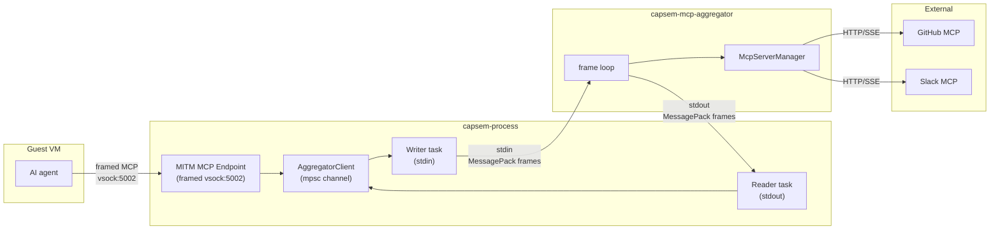
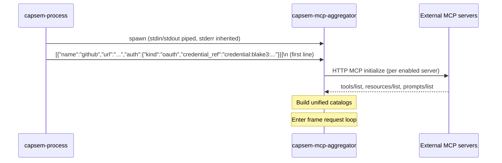

The MCP aggregator (`capsem-mcp-aggregator`) is a low-privilege subprocess that
manages connections to external MCP servers. It has no VM, ledger storage, or
service API authority. Guest MCP requests reach it only through the confined
session proxy after policy evaluation.

## Why a separate process

External MCP servers require network access, broker-resolved auth material,
and custom HTTP headers. The per-VM owner controls virtualization and exact
session runtime paths, while `capsem-ledger` owns storage and `capsem-proxy`
owns MCP policy. Running external server transports inside any of those
processes would combine unrelated authority with remote protocol parsing.

The aggregator subprocess enforces a hard privilege boundary:

| | capsem-process | capsem-mcp-aggregator |
|---|---|---|
| VM control (vsock) | Yes | No |
| Session database path | No | No |
| VirtioFS workspace | Yes | No |
| Scoped service/owner control | Yes | No |
| Network (external MCP servers) | No | Yes |
| Broker-resolved auth material | No | Yes |

If the aggregator is compromised, its remaining authority is the configured
external MCP transport and broker-resolved material needed there. It cannot
control the VM, open a session ledger, or modify the workspace. See
[Host Process Isolation](/architecture/host-isolation/) for the complete
process matrix.

## Architecture

The aggregator sits between the host MITM MCP endpoint (which handles guest VM requests) and external MCP servers (which provide tools like GitHub, Slack, etc.).



The policy boundary is the MITM MCP endpoint, not the aggregator. External
MCP tool calls are inspected, allowed, asked, blocked, or rewritten before the
aggregator receives them. Network traffic that an external MCP server performs
from the host is outside the guest MITM path and does not create guest
`net_events` rows.

Four layers handle the flow:

1. **AggregatorClient** (in capsem-process) -- typed async API wrapping an mpsc channel. Multiple endpoint sessions share one client via `Arc`.
2. **Driver tasks** (in capsem-process) -- writer task serializes requests to subprocess stdin; reader task deserializes responses from stdout and routes them to pending callers via oneshot channels.
3. **Frame loop** (in capsem-mcp-aggregator) -- reads requests from stdin, dispatches to `McpServerManager`, writes responses to stdout.
4. **McpServerManager** (in capsem-core) -- manages `rmcp` HTTP connections to external servers, builds unified tool/resource/prompt catalogs with namespacing.

## Subprocess lifecycle

### Spawn

capsem-process spawns the aggregator during VM startup, after loading MCP server definitions from user and corp config files.



The binary is located next to `capsem-process` in `~/.capsem/bin/`. If not found (dev builds without a full install), capsem-process falls back to an in-process mock that returns empty results for catalog queries and errors for tool calls.

### Steady state

The subprocess runs for the lifetime of the VM. Requests arrive on stdin, responses go to stdout, logs go to stderr (inherited by the parent).

### Shutdown

Two paths:

1. **Normal**: capsem-process sends a `shutdown` request. The aggregator disconnects all servers and exits.
2. **Parent exit**: capsem-process closes stdin (process exit, crash, or signal). The aggregator detects EOF, calls `shutdown_all()`, and exits.

### Crash recovery

If the aggregator crashes, the reader and writer driver tasks in capsem-process exit (broken pipe / EOF). Subsequent requests from the endpoint receive a channel-closed error. The endpoint returns a JSON-RPC error to the guest -- the VM continues running, only external MCP tools become unavailable.

## Frame protocol

Communication uses length-prefixed MessagePack frames over stdin/stdout: a 4-byte big-endian payload length, then a MessagePack map with named fields (`capsem_proto::mcp_aggregator::{read_frame, write_frame}`). The maximum frame is 16 MiB. The examples below show each message's fields as JSON for readability; on the wire they are MessagePack.

### Initialization

The first frame on stdin is the list of server definitions:

```json
[
  {
    "name": "github",
    "url": "https://api.githubcopilot.com/mcp/",
    "headers": {},
    "auth": {
      "kind": "oauth",
      "credential_ref": "credential:blake3:aaaaaaaaaaaaaaaaaaaaaaaaaaaaaaaaaaaaaaaaaaaaaaaaaaaaaaaaaaaaaaaa"
    },
    "enabled": true,
    "source": "claude",
    "unsupported_stdio": false
  }
]
```

Raw API keys, OAuth access tokens, refresh tokens, and `Authorization` headers
are never serialized into MCP config. Remote MCP auth is broker-owned: the
server definition carries only an opaque `credential:blake3:*` reference and
the connector resolves it at the HTTP transport boundary.

Servers marked `unsupported_stdio: true` are stdio-only servers that cannot be connected over HTTP -- the aggregator skips them. Disabled servers are also skipped.

### Request format (process to aggregator)

```json
{"id": 1, "method": "list_servers"}
{"id": 2, "method": "list_tools"}
{"id": 3, "method": "list_resources"}
{"id": 4, "method": "list_prompts"}
{"id": 5, "method": "call_tool", "params": {"name": "github__search_repos", "arguments": {"query": "rust"}}}
{"id": 6, "method": "read_resource", "params": {"uri": "capsem://github/repo://owner/repo"}}
{"id": 7, "method": "get_prompt", "params": {"name": "github__review_pr", "arguments": {}}}
{"id": 8, "method": "refresh", "params": {"servers": [...]}}
{"id": 9, "method": "shutdown"}
```

### Response format (aggregator to process)

```json
{"id": 1, "servers": [{"name": "github", "connected": true, "tool_count": 5, ...}]}
{"id": 2, "tools": [{"namespaced_name": "github__search_repos", "server_name": "github", ...}]}
{"id": 5, "result": {"content": [{"type": "text", "text": "..."}]}}
{"id": 8, "ok": true}
{"id": 9, "ok": true}
```

Error responses:

```json
{"id": 5, "error": "server not found: github"}
```

### Correlation

Each request carries an `id` (monotonically increasing `AtomicU64`). The response echoes the same `id`. The driver's reader task uses a `HashMap<u64, oneshot::Sender>` to route responses back to the correct caller.

## Operations

| Method | Purpose | Response |
|--------|---------|----------|
| `list_servers` | Server definitions with connection status | `servers: [...]` |
| `list_tools` | All discovered tools across connected servers | `tools: [...]` |
| `list_resources` | All discovered resources | `resources: [...]` |
| `list_prompts` | All discovered prompts | `prompts: [...]` |
| `call_tool` | Call a namespaced tool on an external server | `result: {...}` |
| `read_resource` | Read a namespaced resource from an external server | `result: {...}` |
| `get_prompt` | Get a namespaced prompt from an external server | `result: {...}` |
| `refresh` | Disconnect all servers, replace definitions, reconnect | `ok: true` |
| `shutdown` | Disconnect all servers and exit | `ok: true` |

## Tool namespacing

External tools are namespaced with `__` (double underscore) to prevent collisions across servers:

```
github__search_repos     (server "github", tool "search_repos")
slack__send_message      (server "slack", tool "send_message")
```

Resources use URI-based namespacing:

```
capsem://github/repo://owner/repo
```

The aggregator splits on the first `__` when routing, so tool names containing `__` are supported (e.g., `github__my__tool` routes to server `github`, tool `my__tool`).

## Server definition sources

Every VM runs the same MCP servers: the `[mcp]` table of
`~/.capsem/settings.toml` with the corp config's `[mcp]` laid over it, so a
corp entry cannot be shadowed by a user entry. The service writes the merged
result into each session's `vm/active_policy.toml`, and capsem-process builds
the server list from that file only:

1. **Builtin `local` server** (`capsem-mcp-builtin`), unless turned off
2. **Configured servers** from the merged `[mcp]` table

Names containing `__`, empty names, and the reserved names `local` and
`builtin` are rejected.

## Hot reload

The `refresh` operation allows live reconfiguration without restarting the VM:

1. Service receives `POST /mcp/servers/{server_id}/refresh`
2. Service sends `McpRefreshTools` IPC to every running capsem-process
3. capsem-process re-reads its session's `active_policy.toml`
4. Client sends `refresh` with new definitions to the aggregator
5. Aggregator disconnects all servers, replaces definitions, reconnects

This supports adding, removing, or reconfiguring MCP servers while a VM is running.

## Service API integration

The service exposes MCP operations through its HTTP API, which capsem-process handles by delegating to the aggregator:

| Service IPC message | capsem-process action |
|---|---|
| `McpListServers` | `aggregator.list_servers()` |
| `McpListTools` | `aggregator.list_tools()` |
| `McpRefreshTools` | Re-read `active_policy.toml`, `aggregator.refresh(new_servers)` |
| `McpCallTool` | `aggregator.call_tool(name, args)` |

These IPC messages let the CLI, gateway, and frontend query and control MCP servers through the standard service API path.

## Error handling

The aggregator is designed for graceful degradation:

| Scenario | Behavior |
|----------|----------|
| Some servers fail to connect at startup | Warning logged, continue with working servers |
| Tool call to disconnected server | Error response to caller, other tools unaffected |
| Malformed request line | Logged, skipped, loop continues |
| Subprocess crash | Endpoint returns JSON-RPC errors, VM keeps running |
| Serialization failure | JSON-RPC error response written to stdout |
| Stdin EOF | Graceful shutdown (all servers disconnected) |

## Key source files

| File | Purpose |
|------|---------|
| `capsem-mcp-aggregator/src/main.rs` | Subprocess binary: init, frame loop, request dispatch |
| `capsem-core/src/mcp/aggregator.rs` | Protocol types (`AggregatorRequest/Response`) and `AggregatorClient` |
| `capsem-core/src/mcp/server_manager.rs` | `McpServerManager`: rmcp connections, tool catalog, namespacing |
| `capsem-core/src/mcp/mod.rs` | `build_server_list()`: the local builtin server plus the merged `[mcp]` servers |
| `capsem-process/src/main.rs` | `spawn_mcp_aggregator()`: launch and driver tasks for the session's MCP servers |
| `capsem-core/src/net/mitm_proxy/mcp_endpoint.rs` | MITM MCP endpoint: policy, telemetry, and dispatch through the aggregator |
| `capsem-proto/src/ipc.rs` | Service-process IPC messages for MCP operations |
