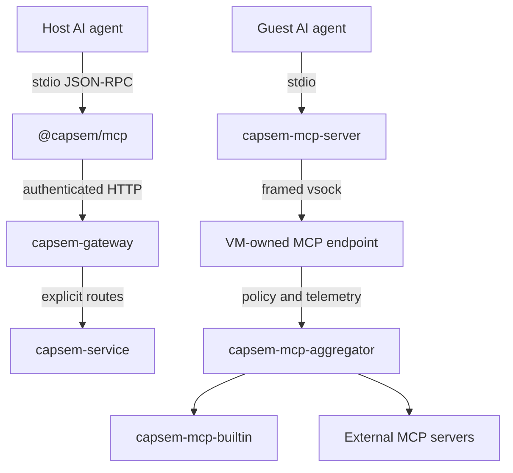
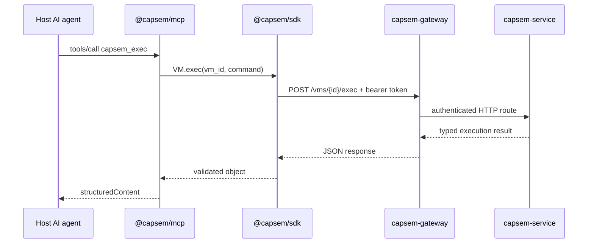
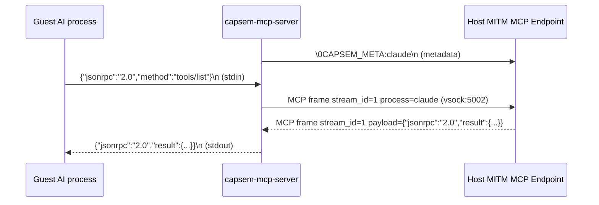
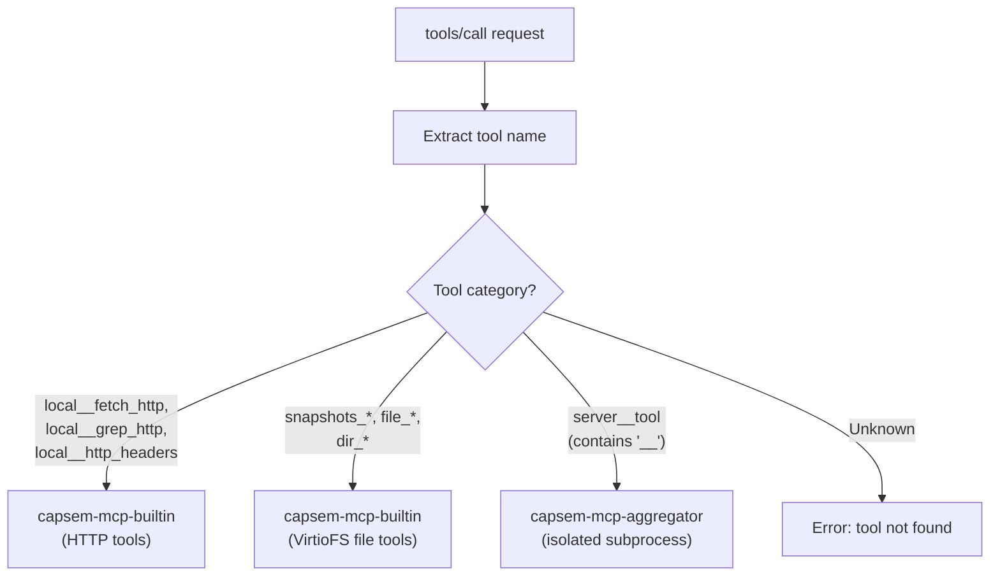

Capsem has two MCP entry points. The standalone npm package `@capsem/mcp`
exposes host control tools to AI clients over stdio. The guest
`capsem-mcp-server` relay carries calls from inside a VM to the host MCP endpoint
over framed vsock.

## Two-entry-point architecture



The npm host is an SDK client. It receives an explicit gateway URL and bearer
token, uses one typed `Hypervisor` transport, and never opens the service UDS,
reads VM runtime files, or launches the service. The native installer does not
install Node.js or the npm package.

The gateway authenticates host control requests before forwarding an explicit
route. The service and VM owner retain lifecycle, trusted identity, policy, and
logger ownership. The npm process formats typed MCP inputs and structured
results; it receives no virtualization entitlement, registry credential, CA
private key, or direct database access.

### Host request flow



Tool discovery, arguments, and return shapes are documented in [MCP Tools](/usage/mcp-tools/).
The transport timeout is separate from a guest command deadline. Cancellation
closes the local HTTP request and does not delete a VM. MCP errors expose a
sanitized category and optional HTTP status without gateway bodies or secrets.

## Guest MCP relay (capsem-mcp-server)

The guest MCP relay is a minimal stdio-to-framed-vsock bridge. It does not route or execute tools; the host MITM MCP endpoint owns parsing, policy, telemetry, and dispatch.

### Framed relay



### Wire protocol

| Step | Data | Direction |
|------|------|-----------|
| 1. Connect | vsock:5002 (`VSOCK_PORT_SNI_PROXY`) | Guest -> Host |
| 2. Metadata | `\0CAPSEM_META:<process_name>\n` | Guest -> Host |
| 3. Relay | Length-prefixed MCP frames containing JSON-RPC payloads | Bidirectional |
| 4. End | stdin closes -> zero-length frame (`MCP_SESSION_END`); the host answers what it owes, then closes | Guest -> Host |

The `\0` prefix distinguishes connection metadata from framed content. Process names are sanitized: control characters and spaces replaced with underscores, truncated to 128 characters. The frame envelope also carries the authoritative per-request process name.

Two threads handle the relay:
- **Main thread**: stdin -> vsock (reads from AI agent, writes to host)
- **Reader thread**: vsock -> stdout (reads from host, writes back to AI agent)

## Tool routing (host endpoint)

The MITM MCP endpoint receives framed JSON-RPC over vsock:5002, normalizes the
frame into the shared `SecurityEvent` rule rail, records protocol evidence, and
routes allowed requests through the aggregator:



### Tool routing categories

| Category | Criteria | Handler | Examples |
|----------|----------|---------|----------|
| Builtin HTTP | `local__fetch_http`, `local__grep_http`, `local__http_headers` | `capsem-mcp-builtin` | `local__fetch_http`, `local__grep_http`, `local__http_headers` |
| File tools | Name starts with `snapshots_`, `file_`, `dir_` | `capsem-mcp-builtin` (VirtioFS only) | `file_read`, `dir_list`, `snapshots_create` |
| External | Contains `__` separator (server namespace) | `AggregatorClient` routes to isolated subprocess | `github__list_repos`, `slack__send_message` |

External tool calls are routed through the [MCP Aggregator](/architecture/mcp-aggregator/) -- an isolated subprocess that manages all external MCP server connections with privilege separation.

### Security-event enforcement

Every `tools/call` request is normalized into a first-party `SecurityEvent` at
the framed MITM boundary before the aggregator sees it. Rules use the shared
security rule rail described in [Policy](/security/policy/), so MCP matches use
fields such as `mcp.method`, `mcp.server.name`, `mcp.tool_call.name`, and
`mcp.tool_list`.

| rule action | Boundary behavior |
|---|---|
| `allow` | Tool call proceeds. |
| `ask` | Request waits for an approval or denial row before dispatch. |
| `block` | Returns a policy JSON-RPC error. The request is not dispatched. |
| `preprocess` / `postprocess` | Runs the configured plugin against the same `SecurityEvent` object. |

The MCP gateway does not own a separate decision provider. Its job is to parse
MCP, attach typed MCP fields to `SecurityEvent`, call the shared security
engine, and log transport evidence plus any `security_rule_events` matches.

## Tool and MCP logging

The product/security tool ledger is `tool_calls`. Every model-native,
built-in/local, or MCP-origin tool invocation must appear there with an origin
such as `native`, `builtin`, `local`, `mcp`, or `mcp_proxy`. Visible MCP
protocol facts such as initialize/list/resource frames are represented as typed
security events and matching `security_rule_events`, not as a second tool-call
ledger. An MCP `tools/call` without a matching `tool_calls` row is a serious
telemetry bug.

See [Session Telemetry](/architecture/session-telemetry/) for the full
`tool_calls`, `tool_responses`, and security-rule ledger joins.

## Endpoint runtime state

| Field | Type | Purpose |
|-------|------|---------|
| `aggregator` | `AggregatorClient` | Client handle for the isolated MCP aggregator subprocess |
| `db` | `Arc<DbWriter>` | Async telemetry writer |
| `security_rules` | `RwLock<Arc<SecurityRuleSet>>` | Hot-reloadable security-event rules |
| `plugin_policy` | `RwLock<Arc<SecurityPluginPolicy>>` | Hot-reloadable plugin modes for security-event preprocessing/postprocessing |

The `AggregatorClient` is cloneable (`Arc`-wrapped mpsc channel) and shared
across endpoint sessions for a given VM. The rule set uses double-Arc style
atomic swap through the endpoint state. New frames read the current rules, so
reloads affect already-open guest MCP connections.

## Configuration files

MCP server definitions are profile-owned. The profile points at `mcp.json`, and
semantic routes mutate MCP server/tool posture through backend-owned profile
rules instead of exposing raw rule text to the UI.

```json
{
  "servers": [
    {
      "id": "capsem",
      "name": "Capsem",
      "description": "Built-in Capsem MCP server for file and snapshot tools",
      "transport": "stdio",
      "command": "/run/capsem-mcp-server",
      "builtin": true,
      "enabled": true
    }
  ]
}
```

Profile MCP config and corp constraints are validated by the service and passed
to the [MCP Aggregator](/architecture/mcp-aggregator/) subprocess at spawn
time. Credentials are broker-owned references, not raw tokens in MCP config.

## Key source files

| File | Purpose |
|------|---------|
| `mcp/typescript/src/` | SDK-backed npm host MCP tool registry and stdio CLI |
| `capsem-agent/src/mcp_server.rs` | Guest relay: stdin/stdout <-> framed MCP over vsock:5002 |
| `capsem-core/src/net/mitm_proxy/mcp_frame.rs` | Framed transport parser, stream lifecycle, and disconnect metrics |
| `capsem-core/src/net/mitm_proxy/mcp_endpoint.rs` | Host endpoint: JSON-RPC dispatch, policy, telemetry |
| `capsem-core/src/mcp/aggregator.rs` | Aggregator protocol types and `AggregatorClient` |
| `capsem-core/src/mcp/builtin_tools.rs` | Builtin HTTP tools (fetch_http, grep_http, http_headers) |
| `capsem-core/src/mcp/file_tools.rs` | File and snapshot tools (VirtioFS workspace) |
| `capsem-core/src/mcp/server_manager.rs` | External MCP server lifecycle and tool catalog |
| `capsem-core/src/net/policy_config/security_rule_profile.rs` | Security-event rule schema, validation, Sigma import, and compiled rule set |
| `capsem-core/src/security_engine/` | SecurityEvent construction, rule evaluation, plugin actions, and rule-ledger emission |
| `capsem-mcp-aggregator/src/main.rs` | Isolated subprocess: MessagePack frame loop, server connections |
| `capsem-process/src/main.rs` | `spawn_mcp_aggregator()`: launch and driver tasks |
| `config/profiles/<id>/mcp.json` | Profile MCP server definitions |

See [MCP Aggregator](/architecture/mcp-aggregator/) for the full subprocess architecture.
