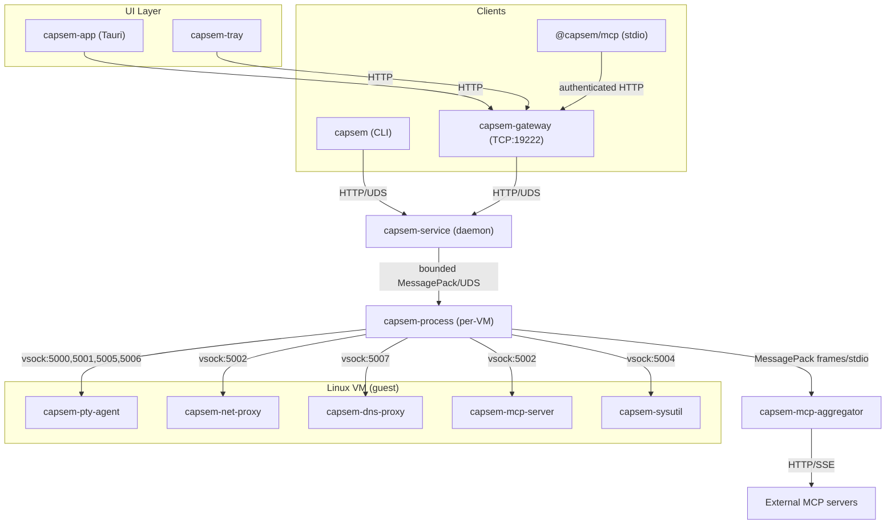

Capsem uses a service-oriented architecture with multiple cooperating binaries. Every VM operation flows through a single path: client -> service -> per-VM process -> guest.

## Host binaries

Seven binaries run on the host machine. They are installed to
`~/.capsem/bin/` by the platform package or source install flow.

| Binary | Role | Communication |
|--------|------|---------------|
| **capsem** | CLI client | HTTP over UDS to service |
| **capsem-service** | Background daemon | Axum HTTP over UDS (`~/.capsem/run/service.sock`) |
| **capsem-process** | Per-VM process | Spawned by service, bounded MessagePack over UDS (after a MessagePack Hello) |
| **capsem-mcp-aggregator** | External MCP server connections | Length-prefixed MessagePack frames over stdin/stdout, spawned by capsem-process |
| **capsem-mcp-builtin** | Built-in HTTP tools | stdio MCP, spawned by the aggregator |
| **capsem-gateway** | HTTP/WebSocket gateway | TCP port 19222, proxies to service UDS |
| **capsem-tray** | System tray | Polls gateway for VM status |

Additionally, **capsem-app** is a thin Tauri webview shell (desktop GUI). It connects to the gateway at `http://127.0.0.1:19222` and has no direct VM logic -- all operations route through the gateway to the service.
The separately installed `@capsem/mcp` npm package connects to the same
authenticated gateway over HTTP and is not part of the native binary package.

## Guest binaries

Five binaries run inside each Linux VM, cross-compiled for `aarch64-unknown-linux-musl` and `x86_64-unknown-linux-musl`. All are deployed chmod 555 (read-only).

| Binary | Role | Vsock port |
|--------|------|------------|
| **capsem-pty-agent** | PTY bridge, control channel, exec, file I/O, kernel audit stream | 5000 (control), 5001 (terminal), 5005 (exec), 5006 (audit) |
| **capsem-net-proxy** | Redirects HTTPS to host MITM proxy | 5002 |
| **capsem-dns-proxy** | Redirects DNS queries to the host DNS policy/resolver path | 5007 |
| **capsem-mcp-server** | Guest MCP stdio-to-framed-vsock relay | 5002 |
| **capsem-sysutil** | Lifecycle multi-call (shutdown/halt/poweroff/reboot/suspend) | 5004 |

## Communication diagram

All clients route through capsem-service. There is no direct VM boot from any other binary.



## IPC protocol stack

Each layer uses a different protocol optimized for its role:

| Layer | Protocol | Socket |
|-------|----------|--------|
| Frontend/Tray -> gateway | HTTP/1.1 over TCP | `127.0.0.1:19222` (Bearer token auth) |
| Gateway -> service | HTTP/1.1 over UDS | `~/.capsem/run/service.sock` |
| CLI -> service | HTTP/1.1 over UDS | `~/.capsem/run/service.sock` |
| SDK/npm MCP -> gateway | HTTP/1.1 over TCP | configured gateway URL (Bearer token auth) |
| Service -> process | 16 MiB bounded, big-endian length-prefixed MessagePack over UDS (after a MessagePack Hello) | `~/.capsem/run/instances/{id}.sock` |
| Process -> guest | Binary frames over vsock | Ports 5000, 5001, 5002, 5004, 5005, 5006, 5007 |

### Vsock port assignments

| Port | Purpose | Binary |
|------|---------|--------|
| 5000 | Control messages (resize, heartbeat, exec, file I/O) | capsem-pty-agent |
| 5001 | Terminal data (PTY I/O) | capsem-pty-agent |
| 5002 | MITM proxy and framed guest MCP endpoint | capsem-net-proxy, capsem-mcp-server |
| 5004 | Lifecycle commands (shutdown/suspend) | capsem-sysutil |
| 5005 | Exec output (direct child stdout) | capsem-pty-agent |
| 5006 | Kernel audit stream | capsem-pty-agent |
| 5007 | DNS proxy queries | capsem-dns-proxy |

## Service lifecycle

### Auto-launch cascade

When the service starts, it spawns two companion processes:

1. **capsem-gateway** -- TCP gateway on port 19222
2. **capsem-tray** -- system tray menu bar icon

All three are separate OS processes. If the service crashes, the LaunchAgent/systemd restarts it automatically.

### Service registration

| Platform | Mechanism | Unit |
|----------|-----------|------|
| macOS | LaunchAgent | `~/Library/LaunchAgents/com.capsem.service.plist` |
| Linux | systemd user unit | `~/.config/systemd/user/capsem.service` |

Both are configured for auto-restart (`KeepAlive`/`Restart=always`) and run-at-login.

### CLI auto-launch

The CLI (`capsem`) auto-launches the service if it's not running. On every service-dependent command:

1. Check socket connectivity
2. Try service manager (LaunchAgent/systemd)
3. Fall back to direct spawn
4. Poll socket for up to 5 seconds

## Per-VM process isolation

Each running VM gets its own `capsem-process` child. This provides security isolation:

- **Minimal environment**: service uses `env_clear()` before spawn -- API keys and tokens from the user's shell never reach the process
- **Socket permissions 0600**: only the owning user can connect to per-VM sockets
- **Session directory 0700**: contains workspace, system, serial.log, session.db
- **No guest-triggered exit**: control channel errors cause loop exit, not `process::exit()`
- **VirtioFS boundary**: only `session_dir/guest/` is shared -- host-only files (session.db, serial.log, checkpoints) are outside the share
- **MCP aggregator isolation**: external MCP server connections run in a separate subprocess (`capsem-mcp-aggregator`) with only network access -- no VM, database, or filesystem access. See [MCP Aggregator](/architecture/mcp-aggregator/) for details.

## Service HTTP API

The service exposes a REST API over UDS. The gateway exposes the same contract
through an explicit allowlist. Unknown paths return 404 at the gateway and are
not forwarded to the service.

`status` means hot runtime counters suitable for polling. `info` means
configuration and identity. Policy, plugins, MCP, and assets are global:
every VM enforces the same merged policy (built-in defaults, `settings.toml`,
corp) and boots the same runtime image set. Request bodies refuse unknown
fields with a 400.

Every client -- CLI, TUI, web terminal, SDKs, MCP -- reaches a VM through these
routes. Only the service talks to a VM owner, over typed IPC; no client dials a
per-VM socket, and `tests/citadel/test_vm_owner_socket_boundary.py` holds it.
The service pulls and stages container images itself, relays exposure changes
to the owner (which admits them against the VM's rules before listening), and
translates each stream WebSocket into a dedicated stream-role owner
connection.

### VM Runtime

| Method | Path | Purpose |
|--------|------|---------|
| POST | `/vms/create` | Create a VM (default 4 CPUs, 12 GiB RAM, 64 GiB scratch disk), optionally with a name, resource overrides, and a `container` workload |
| GET | `/vms/{id}/container` | Container workload setup and runtime state (pulling, staging, staged, starting, running, failed), and the `repository@digest` it resolved to |
| GET | `/images` | Image catalog entries the policy permits: name, description, architectures, the pin this host runs (`?refresh=true` rereads the catalog) |
| POST | `/images/pull` | Resolve a catalog name or reference, check its source, pull it into the host image cache, admit it; 403 when the policy refuses |
| GET/POST | `/vms/{id}/exposures` | List or open loopback port exposures held by the VM owner |
| DELETE | `/vms/{id}/exposures/{exposure_id}` | Close an exposure for good |
| GET | `/vms/{id}/stream` | `capsem.stream.v1` WebSocket: terminal, streaming exec, or attached container |
| GET | `/vms/list` | List VMs and their lifecycle/status metadata |
| GET | `/vms/{id}/info` | VM identity, resources, resume eligibility, and non-hot metadata |
| GET | `/vms/{id}/status` | Runtime state for one VM |
| POST | `/vms/{id}/exec` | Execute command, return stdout/stderr/exit_code |
| POST | `/run` | One-shot: provision + exec + destroy |
| POST | `/vms/{id}/stop` | Stop a VM |
| POST | `/vms/{id}/pause` | Suspend a VM to disk when supported |
| POST | `/vms/{id}/start` | Start a stopped VM |
| POST | `/vms/{id}/resume` | Resume a stopped or paused VM |
| POST | `/vms/{id}/save` | Save current VM state |
| GET | `/vms/{id}/save/status` | Save operation status |
| POST | `/vms/{id}/fork` | Fork VM into a reusable image/VM state |
| GET | `/vms/{id}/fork/status` | Fork operation status |
| DELETE | `/vms/{id}/delete` | Destroy VM and wipe state |
| POST | `/purge` | Stop/delete matching VMs according to the request |
| GET/POST | `/vms/{id}/files/content` | Download or upload exact file bytes through the audited boundary |
| GET | `/vms/{id}/files/list` | List guest files through the file API |
| GET | `/vms/{id}/logs` | Serial/boot logs |
| GET | `/vms/{id}/timeline` | VM event timeline |
| GET | `/vms/{id}/history` | Session history summary |
| GET | `/vms/{id}/history/processes` | Process history |
| GET | `/vms/{id}/history/counts` | History counters |
| GET | `/vms/{id}/history/transcript` | Terminal transcript history |

### Ledger Runtime

| Method | Path | Purpose |
|--------|------|---------|
| GET | `/vms/{id}/security/latest` | Latest `security_rule_events` rows for one VM |
| GET | `/vms/{id}/security/status` | VM-scoped security ledger counters |
| GET | `/vms/{id}/detection/latest` | Latest detection-bearing security rows for one VM |
| GET | `/vms/{id}/detection/status` | VM-scoped detection counters |
| GET | `/vms/{id}/enforcement/latest` | Latest enforcement-bearing security rows for one VM |
| GET | `/vms/{id}/enforcement/status` | VM-scoped enforcement counters |
| GET | `/security/latest` | Service-wide latest security rows |
| GET | `/security/status` | Service-wide security counters |
| GET | `/detection/latest` | Service-wide latest detection rows |
| GET | `/detection/status` | Service-wide detection counters |
| GET | `/enforcement/latest` | Service-wide latest enforcement rows |
| GET | `/enforcement/status` | Service-wide enforcement counters |

### Assets, Plugins, MCP

Every VM boots the one runtime image set of the installed release manifest; a
persistent VM keeps the asset pins it was created with. Policy edits below
write `~/.capsem/settings.toml`, are recorded in the host ledger table
`policy_mutation_events`, and are acknowledged by every running VM (by exact
policy digest) before the route returns.

| Method | Path | Purpose |
|--------|------|---------|
| GET | `/assets/status` | Runtime image set readiness, manifest provenance, and download progress |
| POST | `/assets/ensure` | Start downloading missing runtime assets |
| GET | `/plugins/list` | Every plugin with its effective mode and its source (built in, settings, corp) |
| GET | `/plugins/{plugin_id}/info` | One plugin's config, descriptor, and runtime activity |
| PATCH | `/plugins/{plugin_id}/edit` | Set one plugin's mode or detection level |
| GET | `/plugins/credential_broker/credentials/info` | Credential broker store and brokered activity, no raw secrets |
| POST | `/plugins/credential_broker/credentials/reload` | Retry the durable credential store |
| GET | `/mcp/info` | MCP server count and built-in `local` server state |
| GET | `/mcp/servers/list` | Configured MCP servers |
| GET | `/mcp/default/info` | Default MCP tool permission |
| PATCH | `/mcp/default/edit` | Set the default MCP tool permission |
| GET | `/mcp/servers/{server_id}/tools/list` | Tools for one MCP server, with effective permissions |
| POST | `/mcp/servers/{server_id}/refresh` | Rediscover one server's tools in every running VM |
| PATCH | `/mcp/servers/{server_id}/tools/{tool_id}/edit` | Allow, ask, or block one MCP tool |
| POST | `/mcp/servers/{server_id}/tools/{tool_id}/call` | Call one MCP tool through a running VM |

### Service, Settings, Corp

| Method | Path | Purpose |
|--------|------|---------|
| GET | `/status` | Service status, including runtime asset readiness (`assets`) |
| GET | `/version` | Service version |
| GET | `/stats` | Full telemetry dump (all sessions) |
| GET | `/service-logs` | Service log tail |
| GET | `/triage` | Debug triage bundle |
| GET | `/panics` | Panic log summary |
| GET | `/host-logs/{name}` | Named host log |
| GET | `/settings/info` | The resolved `settings.toml` tree and validation issues |
| PATCH | `/settings/edit` | Batch-edit `app.*`/`appearance.*` preferences in `settings.toml` |
| GET | `/corp/info` | Corporate constraint/reporting config |
| PUT | `/corp/edit` | Replace corporate config |
| POST | `/corp/validate` | Validate corporate config |
| POST | `/corp/reload` | Reload corporate config |

## Installation

Install registers the service and places host binaries under `~/.capsem/bin/`.
The service owns asset resolution and reports missing/downloading/ready state
to the UI and CLI. Provider credentials are configured in normal user/corp
settings or brokered from runtime security events; there is no setup wizard
authority path.

### Install layout

```
~/.capsem/
  bin/                 capsem, capsem-service, capsem-process, capsem-mcp-aggregator, capsem-mcp-builtin, capsem-gateway, capsem-tray
  assets/              manifest.json, manifest-metadata.json, vmlinuz-{hash16}, initrd-{hash16}.img, rootfs-{hash16}.erofs
  run/                 service.sock, service.pid, gateway.token, gateway.port, instances/
  settings.toml        User policy (rules, plugins, MCP, AI providers) and app preferences
  corp.toml            Enterprise constraints/reporting config (optional; wins over settings.toml)
```

### Self-update

`capsem update` checks the release-channel health index at
`release.capsem.org/health.json` for binary freshness and selects the matching
`.pkg` or `.deb` installer metadata for the current install layout. With
`--yes`, it downloads the selected installer into
`~/.capsem/updates/installers/`, verifies size plus SHA-256, prints the tested
package-manager apply command for audit, and executes that command through
`sudo`. VM asset refresh is separate:
`capsem update --assets` hydrates missing
kernel/initrd/rootfs bytes from the installed or overridden manifest, verifies
BLAKE3 hashes, and keeps hash-named files deduplicated.

Installs that shipped before this packaged binary updater cannot be made
self-updating by changing `release.capsem.org`; those binaries do not contain
the package apply path. They need one manual `.pkg` or `.deb` upgrade into a
version with the updater before later binary releases can move independently
from VM asset releases.

## Rust crate architecture

| Crate | Type | What |
|-------|------|------|
| `capsem-core` | lib | All shared business logic (VM, network, policy, telemetry, config) |
| `capsem-service` | bin | Daemon. Axum HTTP over UDS, spawns/manages capsem-process children |
| `capsem-process` | bin | Per-VM. Boots VM via capsem-core, bridges vsock, job store |
| `capsem` | bin | CLI. HTTP over UDS to service, direct UDS to process for shell |
| `capsem-mcp-aggregator` | bin | Isolated subprocess. Manages external MCP server connections over length-prefixed MessagePack frames |
| `capsem-mcp-builtin` | bin | Isolated built-in HTTP MCP tools |
| `capsem-gateway` | bin | HTTP gateway. Axum on TCP:19222, Bearer auth, `/vms/{id}/stream` WebSocket tunnel to the service |
| `capsem-app` | bin | Thin Tauri webview. Points at gateway, bundles web/app/dist for the service-unavailable screen |
| `capsem-tray` | bin | System tray. Polls gateway, shows VM status |
| `capsem-agent` | bin(5) | Guest binaries (pty-agent, net-proxy, dns-proxy, mcp-server, sysutil) |
| `capsem-logger` | lib | Session DB schema, queries, async writer |
| `capsem-proto` | lib | Shared protocol types (host-guest, service-process IPC) |
