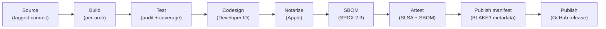
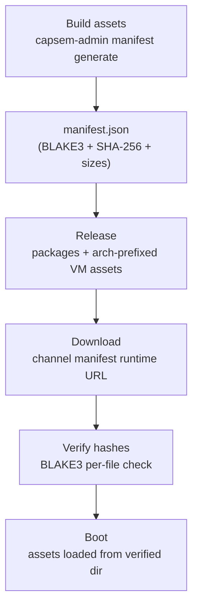

Capsem's release pipeline signs, notarizes, attests, and hash-verifies every artifact from source to installed binary.

## Release pipeline



Every step is automated in `.github/workflows/release.yaml`. A preflight job validates signing credentials before any build starts.

## Code signing

All host binaries are codesigned with a Developer ID certificate. The `com.apple.security.virtualization` entitlement is required for Apple Virtualization.framework.

### Signed binaries

| Binary | Purpose | Entitlement |
|--------|---------|-------------|
| `capsem` | CLI client | `com.apple.security.virtualization` |
| `capsem-service` | Background daemon | `com.apple.security.virtualization` |
| `capsem-process` | Per-VM process | `com.apple.security.virtualization` |
| `capsem-gateway` | HTTP gateway | `com.apple.security.virtualization` |
| `capsem-tray` | System tray | `com.apple.security.virtualization` |
| `Capsem.app` | Tauri desktop app | `com.apple.security.virtualization` |

### Development vs release signing

| Context | Signing | Command |
|---------|---------|---------|
| Development | Ad-hoc (`--sign -`) | `just build` (automatic) |
| Release | Developer ID certificate | `codesign --sign "$APPLE_SIGNING_IDENTITY" --entitlements build_system/packaging/macos/entitlements.plist --force` |

Ad-hoc signing is sufficient for local development. The justfile handles this automatically on macOS.

## Notarization

Release builds are submitted to Apple for notarization, which scans for malware and validates the signature:

```
xcrun notarytool submit Capsem-$VERSION.pkg \
  --key $APPLE_API_KEY_PATH \
  --key-id $APPLE_API_KEY \
  --issuer $APPLE_API_ISSUER \
  --wait --timeout 30m
xcrun stapler staple Capsem-$VERSION.pkg
```

Stapling embeds the notarization ticket in the artifact so macOS can verify it offline.

## SBOM and OBOM

Host binaries publish a Software Bill of Materials using `cargo-sbom`:

```
cargo sbom --output-format spdx_json_2_3 > capsem-sbom.spdx.json
```

| Field | Value |
|-------|-------|
| Format | SPDX 2.3 JSON |
| Scope | All Rust crate dependencies |
| Published as | `capsem-sbom.spdx.json` in GitHub release |
| Attestation | SBOM attested against the macOS `.pkg` artifact |

VM base images publish an Operations Bill of Materials as CycloneDX JSON. CI
generates it with pinned cdxgen `-t os` against the extracted exported Linux
rootfs directory (never the build host `/`) before EROFS cleanup, pins it in
`manifest.json`, and publishes it with the runtime assets. That exact invocation
is qualified against the complete Capsem filesystem, not only a tiny fixture.

| Field | Value |
|-------|-------|
| Format | CycloneDX OBOM JSON |
| Scope | Base Linux VM image only |
| Excludes | User session mutations, workspace writes, and post-boot state |
| Published as | `<arch>-obom.cdx.json` with the runtime assets |
| Integrity | SHA-256 and BLAKE3 recorded in the channel manifest's `runtime` evidence |
| Runtime API | `GET /update/status` reports it as the `vm_obom` supply-chain reference |

The runtime's OBOM evidence entry records the OBOM file URL, hashes, and size
in the channel manifest. The service names it in its supply-chain evidence
(`vm_obom`: CycloneDX, base-image scope, `cdxgen`, produced by
`release-assets.yaml`).

The per-architecture `build-ledger.log` is separate debug evidence. It records
the inputs that produced the assets, including the exact kernel version and
source SHA-256, rendered Dockerfiles, build context hashes, EROFS settings,
git/project version, and the declared runtime package set
(`runtime_apt_packages`). The kernel archive is verified against that SHA-256 before
extraction. The ledger is not uploaded as the
release inventory and must not claim installed package state; installed
component names and versions come from the OBOM.

## SLSA attestation

Release artifacts receive [SLSA build provenance](https://slsa.dev/) attestation
through a reviewed, full-commit-SHA pin of `actions/attest-build-provenance`:

| Artifact | Attestation |
|----------|-------------|
| `.pkg` (macOS installer) | Build provenance |
| `.deb` (Linux package) | Build provenance |
| `vmlinuz`, `initrd.img`, `rootfs.erofs`, `obom.cdx.json` (arm64) | VM asset build provenance |
| `vmlinuz`, `initrd.img`, `rootfs.erofs`, `obom.cdx.json` (x86_64) | VM asset build provenance |
| `.pkg` | SBOM (SPDX 2.3) |
| `<arch>-obom.cdx.json` | OBOM document, hash-pinned in `manifest.json` |

Attestations are published to the GitHub Attestations API and can be verified with `gh attestation verify`.
The VM `build-ledger.log` and `B3SUMS` outputs remain debug evidence unless a
future release intentionally publishes them as separate evidence artifacts.

## Asset integrity

VM assets (kernel, initrd, rootfs) are recorded with BLAKE3 and SHA-256 at the
asset build boundary and verified via BLAKE3 identity at every stage
from build to boot. Asset URLs, hashes, and sizes come directly from
`cache/target/assets/manifest.json` locally and from the selected channel
manifest's `runtime` document once released.
Published GitHub Release blob names are arch-prefixed, for example
`arm64-rootfs.erofs`; inside the manifest they remain bare names such as
`rootfs.erofs` under the owning architecture.

`cache/target/assets/manifest.json` is generated through `capsem-admin manifest generate
<assets_dir>`. Release automation, local packaging, and corp custom builds use
that same admin command; lower-level manifest generation internals are not a
supported public path.

### Verification flow



### Release graph schema

The public update graph starts at `https://release.capsem.org/channels.json`.
It lists channels such as stable and nightly. Each channel contains versioned
manifest records, and every record has exactly one `status` enum value:
`current`, `supported`, `deprecated`, or `revoked`. Manifest records carry
`version`, URL, SHA-256, and BLAKE3 metadata. HMAC fields are not published. They remain present for
auditability; absence from the channel list is removal.

The selected manifest is the compatibility and hash authority for one channel.
It lists package artifacts separately from the per-binary inventory and
carries one `runtime` document for the VM assets:

```json
{
  "version": "1.4.0",
  "channel": "stable",
  "packages": [
    {
      "name": "Capsem-1.4.0.pkg",
      "kind": "macos-pkg",
      "url": "https://github.com/google/capsem/releases/download/v1.4.0/Capsem-1.4.0.pkg",
      "sha256": "<sha256>",
      "blake3": "<blake3>",
      "bytes": 12345678,
      "sbom": "https://github.com/google/capsem/releases/download/v1.4.0/capsem-sbom.spdx.json"
    }
  ],
  "binaries": [
    {
      "name": "capsem",
      "version": "1.4.0",
      "package": "Capsem-1.4.0.pkg",
      "path": "/usr/local/bin/capsem",
      "sha256": "<sha256>",
      "blake3": "<blake3>",
      "sbom_component": "SPDXRef-File-capsem"
    }
  ],
  "runtime": {
    "revision": "1.4.0-0123456789ab",
    "status": "current",
    "min_capsem_version": "1.4.0",
    "architectures": [
      {
        "architecture": "arm64",
        "image_revision": "1.4.0-0123456789ab",
        "software": [],
        "images": [
          {"kind": "rootfs", "name": "rootfs.erofs", "url": "...", "bytes": 12345678,
           "digest": {"sha256": "<sha256>", "blake3": "<blake3>"}, "status": "current"}
        ],
        "evidence": []
      }
    ]
  }
}
```

The runtime owns the VM images, software inventory, and OBOM evidence for each
architecture. It may declare `min_capsem_version` when its images require newer
client behavior, but it does not select the Capsem binary. The manifest selects
package and binary metadata; the `runtime` document inside that manifest
selects image and evidence metadata. No config file is published:
applications reach a session as OCI images resolved
through the image catalog, not through the release manifest.

Stable and nightly are independent channels. A stable-to-nightly switch is just
choosing a different manifest URL, for example
`https://release.capsem.org/assets/stable/manifest.json` or
`https://release.capsem.org/assets/nightly/manifest.json`, and the release gate
proves package, per-binary, runtime image, and evidence data do not cross
between channels.

### Hash verification

BLAKE3 hashes are computed in 256 KB chunks:

```rust
pub fn hash_file(path: &Path) -> Result<String> {
    let mut hasher = blake3::Hasher::new();
    loop {
        let n = file.read(&mut buf)?;
        if n == 0 { break; }
        hasher.update(&buf[..n]);
    }
    Ok(hasher.finalize().to_hex().to_string())
}
```

Validation rules:
- Hash must be exactly 64 hex characters
- Filenames must not contain `/`, `\`, or `..` (path traversal prevention)
- Version strings must not contain `..`, `/`, or `\`
- Empty releases are rejected

### Multi-version channels

Channels accumulate versioned manifest records across releases. Adding a new
stable or nightly manifest does not require mutating the runtime, packages,
or other channels. Deprecating or revoking a manifest changes the record status;
publishing no record at all means that manifest is removed from the public
channel list. Runtime selection ignores revoked records.

## Manifest Role

`manifest.json` is channel metadata: package artifacts, per-binary inventory,
the runtime document, hashes, and compatibility. It is published
with SBOM and provenance attestations. Runtime trust comes from the selected
manifest URL, runtime-owned file metadata, SHA-256/BLAKE3 verification of the
downloaded bytes, and immutable release provenance. Channel assembly reuses
the complete asset digests recorded at build time instead of reopening the
same rootfs for each channel. Local blob copies hash and validate in their
single copy stream; historical releases are never hydrated from current paths.

For a custom corp package, generate and verify the manifest from the built asset
directory before packaging:

```bash
capsem-admin manifest generate /path/to/assets --version 1.3.corp.1 --json
capsem-admin manifest check /path/to/assets/manifest.json --json
bash build_system/packaging/macos/build-pkg.sh --manifest file:///path/to/assets/manifest.json ...
```

The installer records that manifest URL in packaged `manifest-metadata.json`, then
postinstall runs `capsem update --assets --manifest <URL>` to hydrate the live
installed manifest and assets. Status reports the installed manifest hash plus
metadata provenance. `--manifest` is URL-only so custom local manifests use `file://` and hosted
corporate channels use `https://` or `http://`.

## Supply chain controls

| Control | Implementation |
|---------|---------------|
| Rust toolchain | Rust 1.97.1, pinned consistently in the workspace, workflows, bootstrap, and host builder |
| Dependency audit | Pinned OSV-Scanner checks every Python and Node lockfile first; only a clean result unlocks the stricter RustSec vulnerability, unsoundness, and yank policy. Exact clean OSV verdicts are reused for one hour when every lockfile and policy byte still matches. |
| Docker base images | Pinned by exact child-manifest digest in `config/docker/image/build.toml` |
| Compiler warnings | Treated as errors, with workspace `dbg_macro` and `todo` lints denied |
| Auditable builds | `cargo-auditable` embeds dependency info in binaries |
| Build context validation | `capsem.builder.doctor.check_source_files()` verifies completeness before release |
| Rootfs binary verification | Release pipeline checks all required guest binaries exist in rootfs before packaging |

### Required guest binaries

The release pipeline verifies these binaries exist in the rootfs before packaging:

| Binary | Purpose |
|--------|---------|
| `capsem-pty-agent` | PTY bridge and control channel |
| `capsem-net-proxy` | HTTPS proxy bridge |
| `capsem-mcp-server` | Guest MCP relay |
| `capsem-doctor` | In-VM diagnostics |
| `capsem-bench` | Performance benchmarks |
