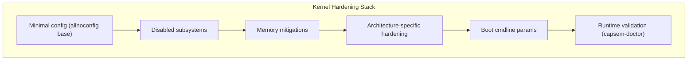
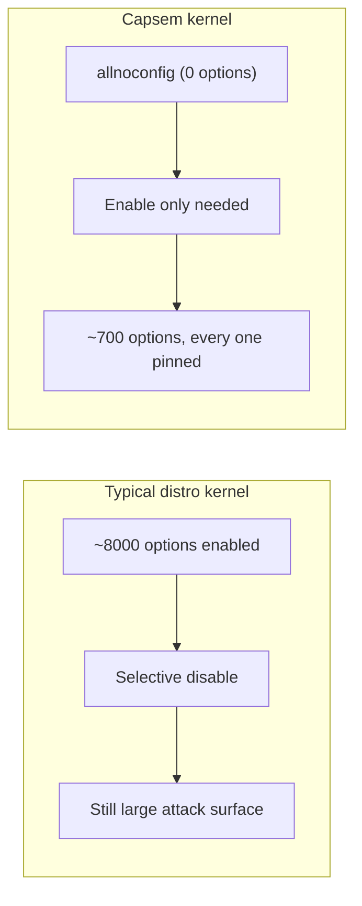

Capsem builds a custom Linux kernel from `allnoconfig` -- starting with everything disabled and enabling only what the VM needs. The result is a ~5 MB kernel with no loadable modules, no debugfs, no IPv6, and full exploit mitigations.

## Why it matters

An unhardened guest kernel gives a malicious agent multiple escalation paths:

| Vector | Risk without hardening |
|--------|----------------------|
| Loadable modules | Agent loads a `.ko` to hijack kernel functions |
| `/dev/mem`, `/dev/port` | Direct physical memory read/write from userspace |
| debugfs | Kernel internals exposed to guest processes |
| BPF, io_uring | High-CVE-count subsystems reachable via syscall |
| 32-bit compat syscalls | Legacy ABI with known exploitation primitives |
| `/proc/kallsyms` | Kernel symbol addresses defeat KASLR |

Capsem eliminates all of these at compile time.

## Defense layers



## Disabled subsystems

Every disabled subsystem removes code from the kernel binary. No runtime flag can re-enable it.

| Subsystem | Config | Why disabled |
|-----------|--------|-------------|
| Loadable modules | `MODULES=n` | Prevents loading `.ko` files; even root cannot extend the kernel |
| `/dev/mem` | `DEVMEM=n` | Blocks direct physical memory access from userspace |
| `/dev/port` | `DEVPORT=n` | Blocks I/O port access |
| debugfs | `DEBUG_FS=n` | Kernel debug info leak vector |
| Kernel symbols | `KALLSYMS=n` | Hides kernel addresses, preserves KASLR effectiveness |
| io_uring | `IO_URING=n` | High CVE count; unnecessary in a sandboxed VM |
| BPF syscall | `BPF_SYSCALL=n` | Exploitation vector for privilege escalation |
| userfaultfd | `USERFAULTFD=n` | Used in race condition exploits |
| 32-bit compat | `COMPAT=n` / `IA32_EMULATION=n` | Eliminates entire legacy syscall attack surface |
| kexec | `KEXEC=n`, `KEXEC_FILE=n` | No kernel hot-swap |
| Hibernation | `HIBERNATION=n` | No suspend-to-disk (memory dump vector) |
| Magic SysRq | `MAGIC_SYSRQ=n` | No emergency keyboard commands |
| IPv6 | `IPV6=n` | Unnecessary in air-gapped VM; reduces IP stack surface |
| Multicast | `IP_MULTICAST=n` | No multicast traffic |
| nftables | `NF_TABLES=y` | Guest NAT uses `iptables-nft`; legacy iptables frontends are stripped |
| USB | `USB_SUPPORT=n` | No USB devices in VM |
| Sound | `SOUND=n` | No audio hardware |
| DRM/GPU | `DRM=n` | No graphics hardware |
| WiFi/Bluetooth | `WLAN=n`, `WIRELESS=n`, `BT=n` | No wireless hardware |
| Keyboard/Mouse | `INPUT_KEYBOARD=n`, `INPUT_MOUSE=n` | No HID devices |
| NFS | `NFS_FS=n`, `NETWORK_FILESYSTEMS=n` | No remote filesystems |
| SCSI/ATA | `SCSI=n`, `ATA=n` | VirtIO only; no legacy block drivers |
| Ethernet | `ETHERNET=n`, `NET_VENDOR_VIRTIO=n` | Air-gapped; only dummy NIC |
| TIOCSTI | `LEGACY_TIOCSTI=n` | Injecting keystrokes into another process's terminal |
| Line-discipline autoload, legacy PTYs | `LDISC_AUTOLOAD=n`, `LEGACY_PTYS=n` | Old tty attack surface |
| Cross-process memory access | `CROSS_MEMORY_ATTACH=n` | No `process_vm_readv`/`process_vm_writev` |
| Core dumps | `COREDUMP=n` | Process memory never written to disk |
| Tracing | `FTRACE=n`, `UPROBES=n` (x86) | No kernel tracing interfaces |
| Slab debugging | `SLUB_DEBUG=n` | No slab debug surface |
| Writes to mounted block devices | `BLK_DEV_WRITE_MOUNTED=n` | Corrupting a mounted filesystem from userspace |
| Firmware, EFI, power management | `FW_LOADER=n`, `EFI=n`, `PM=n` | No firmware loading, EFI runtime services or suspend |
| Legacy x86 entry points | `X86_VSYSCALL_EMULATION=n`, `MODIFY_LDT_SYSCALL=n`, `X86_IOPL_IOPERM=n`, `X86_16BIT=n` | No vsyscall page, per-process LDT, userspace port I/O or 16-bit segments |

## Namespaces

The OCI workload runs in its own PID, mount, IPC, UTS, network and user namespaces (`NAMESPACES`, `PID_NS`, `IPC_NS`, `UTS_NS`, `NET_NS`, `USER_NS`). The user namespace lets the workload hold the capabilities it needs over a mapped uid range instead of over the VM, so container root is not VM root.

Only the container launcher can create a user namespace. Every guest service, and everything it spawns, runs under `chroot /newroot`, and the kernel refuses `CLONE_NEWUSER` from a chroot; the launcher alone moves `/newroot` to `/` in its own mount namespace first.

User namespaces also expose more kernel code to the workload, which is why io_uring, the BPF syscall and userfaultfd stay compiled out. `build_system/tests/image/test_kernel_defconfig.py` pins these options on both architectures.

## Memory mitigations

| Mitigation | Config | Effect |
|-----------|--------|--------|
| Heap zeroing | `INIT_ON_ALLOC_DEFAULT_ON=y` | Every `kmalloc` returns zeroed memory; prevents info leaks |
| Slab freelist randomization | `SLAB_FREELIST_RANDOM=y` | Randomizes freed slab object order; defeats heap spraying |
| Slab freelist hardening | `SLAB_FREELIST_HARDENED=y` | Validates freelist metadata; detects heap corruption |
| Page allocator shuffle | `SHUFFLE_PAGE_ALLOCATOR=y` | Randomizes page allocation order |
| Hardened usercopy | `HARDENED_USERCOPY=y` | Validates `copy_to_user`/`copy_from_user` bounds |
| Strict kernel RWX | `STRICT_KERNEL_RWX=y` | Enforces W^X on kernel memory pages |
| Virtual mapped stacks | `VMAP_STACK=y` | Kernel stacks as virtual memory; detects overflow via guard pages |
| KASLR | `RANDOMIZE_BASE=y` | Randomizes kernel load address |
| Stack protector | `STACKPROTECTOR=y`, `STACKPROTECTOR_STRONG=y` | Stack canaries on all functions with local variables |
| FORTIFY_SOURCE | `FORTIFY_SOURCE=y` | Compile-time buffer overflow detection |
| dmesg restriction | `SECURITY_DMESG_RESTRICT=y` | Only root can read kernel log |
| Heap ASLR | `COMPAT_BRK=n` | Enables full heap randomization |
| Seccomp | `SECCOMP=y`, `SECCOMP_FILTER=y` | Userspace syscall filtering (defense in depth) |

## Architecture-specific hardening

The kernel includes different hardware mitigations depending on the target architecture.

| Mitigation | arm64 | x86_64 | Purpose |
|-----------|-------|--------|---------|
| Branch Target Identification | `ARM64_BTI=y` | -- | Spectre-BHB mitigation; restricts indirect branch targets |
| Pointer Authentication | `ARM64_PTR_AUTH=y`, `ARM64_PTR_AUTH_KERNEL=y` | -- | Signs return addresses; defeats ROP chains |
| Kernel unmapping at EL0 | `UNMAP_KERNEL_AT_EL0=y` | -- | Removes kernel pages from userspace page tables |
| Spectre-BHB mitigation | `MITIGATE_SPECTRE_BRANCH_HISTORY=y` | -- | Clears branch history on exception entry |
| Page Table Isolation (KPTI) | -- | `MITIGATION_PAGE_TABLE_ISOLATION=y` | Meltdown mitigation; separate kernel/user page tables |
| Retpoline | -- | `MITIGATION_RETPOLINE=y` | Spectre v2 mitigation; replaces indirect branches |
| Speculative-execution mitigations | Spectre-BHB, errata workarounds | Every `MITIGATION_*` (Retbleed, SRSO, MDS, L1TF, SSB, BHI, GDS, RFDS, TAA, ITS, TSA, ...) | Each pinned; none is left to a default |
| Kernel address randomization | `RANDOMIZE_BASE=y` | `RANDOMIZE_BASE=y`, `RANDOMIZE_MEMORY=y` | KASLR and randomized kernel memory regions |
| Kernel stack offset randomization | `RANDOMIZE_KSTACK_OFFSET_DEFAULT=y` | `RANDOMIZE_KSTACK_OFFSET_DEFAULT=y` | A different stack offset on every syscall |
| Control-flow integrity | `ARM64_BTI=y`, `ARM64_GCS=y` | `X86_KERNEL_IBT=y`, `X86_USER_SHADOW_STACK=y` | Indirect-branch tracking and shadow stacks |
| Privileged-access restrictions | `ARM64_PAN=y`, `ARM64_EPAN=y`, `ARM64_E0PD=y` | `X86_UMIP=y` | Kernel cannot touch user memory unintentionally; user cannot read descriptor tables |

## Boot command line

Runtime hardening parameters passed via kernel cmdline. One constant, `KERNEL_CMDLINE` in `capsem-core`, is the only place it is spelled:

```
console={hvc0|ttyS0} root=/dev/vda ro loglevel=4 quiet init_on_alloc=1 init_on_free=1 slab_nomerge page_alloc.shuffle=1 oops=panic random.trust_cpu=1
```

| Parameter | Rationale |
|-----------|-----------|
| `ro` | Mount rootfs read-only; EROFS is structurally immutable |
| `init_on_alloc=1` | Heap pages are zeroed when allocated, so stale data never reaches a new owner |
| `init_on_free=1` | Heap pages are zeroed when freed, so freed secrets do not linger in memory |
| `slab_nomerge` | Prevents kernel from merging slab caches; isolates allocations by type |
| `page_alloc.shuffle=1` | Randomizes page allocator at boot (complements `SHUFFLE_PAGE_ALLOCATOR`) |
| `oops=panic` | A kernel oops ends the VM instead of leaving it on a kernel in an unknown state, where a failed exploit could be retried |
| `loglevel=4 quiet` | Kernel warnings and errors still reach the serial console kept for diagnosis |
| `random.trust_cpu=1` | The CPU's RNG seeds the entropy pool at boot |

Console device varies by architecture: `hvc0` for ARM64 (Apple VZ), `ttyS0` for x86_64 (KVM).

## Boot-time sysctls

`capsem-init` sets these before any service starts. A value the kernel refuses stops the boot, and capsem-doctor reads every one back (`test_hardening_sysctl_holds`).

| Sysctl | Value | Why |
|--------|-------|-----|
| `kernel.kptr_restrict` | 2 | Kernel pointers are never shown, even to root |
| `kernel.dmesg_restrict` | 1 | The kernel log needs `CAP_SYSLOG` |
| `kernel.randomize_va_space` | 2 | Full userspace address randomization |
| `kernel.yama.ptrace_scope` | 1 | `ptrace` only of your own descendants: a package script cannot attach to the agent CLI beside it and read its credentials |
| `kernel.perf_event_paranoid` | 2 | x86 only: `perf_event_open` cannot be compiled out there, so unprivileged use is denied |
| `fs.protected_symlinks`, `fs.protected_hardlinks` | 1 | Link-following attacks in shared directories |
| `fs.protected_fifos`, `fs.protected_regular` | 1 | Opening another user's FIFO or file in a world-writable sticky directory |
| `fs.suid_dumpable` | 0 | No core dumps of setuid programs |
| `vm.mmap_min_addr` | 65536 | NULL-page mappings, the classic kernel NULL-dereference exploit |
| `dev.tty.ldisc_autoload`, `dev.tty.legacy_tiocsti` | 0 | Line-discipline autoload and terminal keystroke injection |
| `net.ipv4.conf.{all,default}.accept_redirects`, `secure_redirects`, `send_redirects`, `accept_source_route` | 0 | The guest is not a router |
| `net.ipv4.icmp_echo_ignore_broadcasts`, `icmp_ignore_bogus_error_responses` | 1 | ICMP noise |
| `net.ipv4.tcp_syncookies`, `tcp_rfc1337` | 1 | Listeners stay responsive under SYN floods; TIME-WAIT assassination |

`rp_filter` is deliberately left off: the VM routes between its network cables and the workload's veth asymmetrically, which strict reverse-path filtering would drop.

## Validation

Every hardening property is verified at runtime by `capsem-doctor` tests. If any test fails, the VM is not considered healthy.

| Property | capsem-doctor test | What it checks |
|----------|-------------------|----------------|
| No kernel modules | `test_no_kernel_modules` | `modprobe` fails |
| No `/dev/mem` | `test_no_dev_mem` | File does not exist |
| No `/dev/port` | `test_no_dev_port` | File does not exist |
| No `/proc/kcore` | `test_no_proc_kcore` | File absent or unreadable |
| No `/proc/modules` | `test_proc_modules_empty` | File absent or empty |
| No debugfs | `test_no_debugfs` | Not mounted |
| No IPv6 | `test_no_ipv6` | `/proc/net/if_inet6` absent |
| No kernel symbols | `test_no_kallsyms` | `/proc/kallsyms` absent or empty |
| Read-only rootfs | `test_kernel_cmdline_has_ro` | `ro` token in `/proc/cmdline` |
| Heap zeroing | `test_init_on_alloc`, `test_heap_is_zeroed_on_alloc_and_on_free` | `init_on_alloc=1` in `/proc/cmdline`; kernel reports heap alloc and free zeroing on |
| Oops ends the VM | `test_an_oops_panics_the_vm` | `kernel.panic_on_oops` is 1 |
| Slab isolation | `test_slab_nomerge` | `slab_nomerge` in `/proc/cmdline` |
| Page shuffle | `test_page_alloc_shuffle` | `page_alloc.shuffle=1` in `/proc/cmdline` |
| Seccomp available | `test_seccomp_available` | `Seccomp:` line in `/proc/self/status` |
| User namespaces only for the workload | `test_guest_services_cannot_create_user_namespaces` | `unshare(CLONE_NEWUSER)` from a guest service fails `EPERM` (kernel support present, refused from the services' chroot), not `EINVAL` |
| Read-only rootfs | `test_sandbox_filesystem_type` | `/dev/vda` filesystem type is `erofs` on 1.3 assets |
| Overlay configured | `test_overlay_configured` | Root mount is `overlay` with `lowerdir` and `upperdir` |
| No real NICs | `test_no_real_nics` | Only `lo` and `dummy0` in `/sys/class/net/` |
| No setuid binaries | `test_no_setuid_binaries` | `find / -perm -4000` returns empty |
| No setgid binaries | `test_no_setgid_binaries` | `find / -perm -2000` returns empty |
| Guest binaries read-only | `test_guest_binary_not_writable` | All capsem binaries are chmod 555 |
| No sshd | `test_no_sshd` | `sshd` process not running |
| No cron | `test_no_cron` | `cron` process not running |
| No systemd | `test_no_systemd` | `systemd` process not running |

## Design philosophy

The kernel config follows the principle of **minimum viable surface**: start from `allnoconfig` (everything off), then enable only what the VM requires. This is the opposite of a typical distro kernel, which starts from a broad default and disables selectively.



The two defconfig files (`defconfig.arm64`, `defconfig.x86_64`) are applied on top of allnoconfig with `make KCONFIG_ALLCONFIG=<defconfig> allnoconfig`, so the kernel enables nothing the defconfig does not pin. Each pin carries its reason in the file, and both architectures get the same security properties.

Kconfig silently ignores a pinned option it cannot apply: a misspelled or renamed symbol, or one whose dependencies are unmet. The kernel build therefore compares every pinned line of the defconfig with the configuration Kconfig produced and fails, naming each option the kernel did not honor. Starting from allnoconfig makes that check carry real weight: an option whose dependency is not pinned is dropped, and the build says so.

### Source patches

The kernel is built from the pinned kernel.org release plus the patches listed under `[build.kernel] patches` in `config/docker/image/build.toml`, applied in order before configuration. Each is applied with `--fuzz=0`, so a kernel bump that moves the patched code fails the build instead of shipping without the patch. Every patch states its reason in its header, and `build_system/tests/image/test_kernel_defconfig.py` fails if a patch file on disk is not in the list.

| Patch | Why |
|-------|-----|
| `0001-fuse-refuse-posix-acls-without-fuse-posix-acl` | Apple's VirtioFS server stores POSIX ACL xattrs without applying them, so `cp -a` into `/root` lost group and other permission bits. FUSE filesystems whose server does not negotiate `FUSE_POSIX_ACL` now refuse ACLs, as upstream already does outside the initial user namespace, and tools fall back to chmod. |
