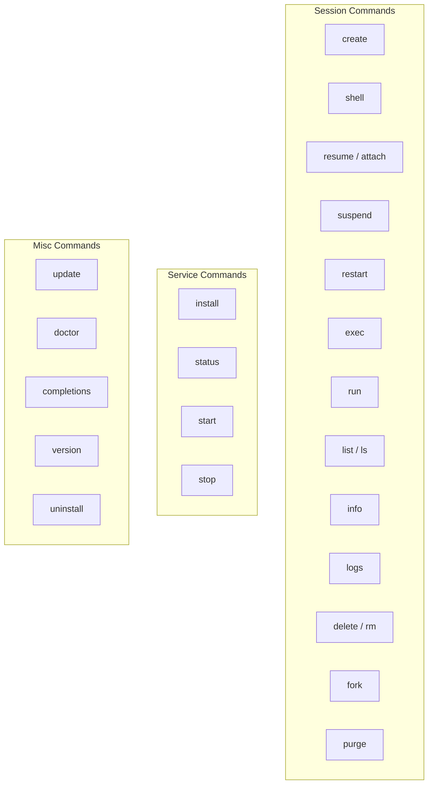
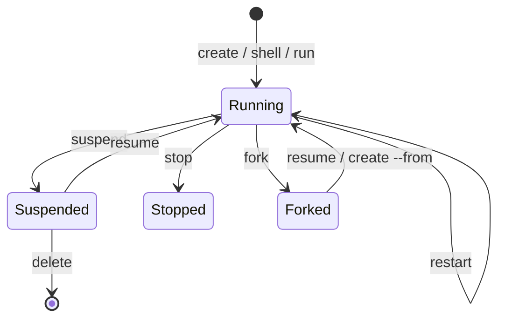

The `capsem` CLI manages sessions, the background service, and system configuration. All session operations route through the service daemon over a Unix Domain Socket.

## Command overview



## Session commands

### create

Create and boot a new session from a profile. Use `-n <name>` for a retained,
named VM that can be stopped, resumed, forked, and inspected later.

```sh
capsem create                          # unnamed session
capsem create -n mybox                 # named retained session
capsem create -n mybox --ram 8 --cpu 4 # custom resources
capsem create --from template          # clone from existing session
capsem create -e API_KEY=sk-...        # with environment variables
capsem create -n cache -p 0:6379 --image docker://redis:7-alpine
                                       # an OCI image's workload, detached
```

With `--image`, the VM's workload is the image's command, or everything given
after the image (so options go before `--image`), started detached; its output is in `capsem logs`. Like any
session, the VM is kept only when it is named.

| Flag | Default | Description |
|------|---------|-------------|
| `-n, --name <NAME>` | -- | Name for the session |
| `--ram <GB>` | profile's | RAM in GB |
| `--cpu <CORES>` | profile's | CPU cores |
| `-e, --env <KEY=VALUE>` | -- | Environment variables (repeatable); the container's with `--image` |
| `--from <NAME>` | -- | Clone state from an existing retained session/template |
| `--network <NAME>` | -- | Join a named network (repeatable) |
| `--image <IMAGE>` | -- | OCI image to run: `docker://IMAGE` or `registry/repository:tag` |
| `-p, --publish <HOST:GUEST>` | -- | With `--image`: publish a loopback TCP port (host `0` picks one) |
| `--registry-ca <PEM>` | -- | With `--image`: extra CA trusted for this pull |
| `--registry-user <USER>` | -- | With `--image`: registry user; token from `CAPSEM_REGISTRY_PASSWORD` |

### shell

Open the terminal UI. With no arguments it shows every session; with a name or
ID it opens focused on that session. It never creates or destroys a VM: use
`capsem create` or `capsem run` for that.

```sh
capsem shell              # every session
capsem shell mybox        # attach to existing session
capsem shell -n mybox     # find by name
capsem shell abc123       # find by ID
```

| Flag | Description |
|------|-------------|
| `-n, --name <NAME>` | Find by name |
| `[SESSION]` | Name or ID of an existing session |

### resume

Resume a suspended session or attach to a running one.

```sh
capsem resume mybox
capsem attach mybox       # alias
```

| Arg | Description |
|-----|-------------|
| `<name>` | Name of the session |

### suspend

Suspend a running retained session to disk. Saves RAM and CPU state.

```sh
capsem suspend mybox
```

| Arg | Description |
|-----|-------------|
| `<SESSION>` | Name or ID of the session |

### restart

Restart a session.

```sh
capsem restart mybox
```

| Arg | Description |
|-----|-------------|
| `<name>` | Name of the session |

### exec

Execute a command in a running session.

```sh
capsem exec mybox "ls -la /root"
capsem exec mybox "pip install numpy" --timeout 120
```

| Arg/Flag | Default | Description |
|----------|---------|-------------|
| `<SESSION>` | -- | Name or ID of the session |
| `<command>` | -- | Command to execute |
| `--timeout <SECS>` | 30 | Timeout in seconds |

### run

Run a command in a fresh one-shot session. The session is provisioned and
destroyed after the command completes. With `--image`, the command is an OCI
image's workload: its output streams, `capsem run` exits with its status, and
the VM is destroyed however the run ends (exit, timeout, or Ctrl-C).

```sh
capsem run "python3 -c 'print(1+1)'"
capsem run "npm test" --timeout 120
capsem run "pytest" -e API_KEY=sk-...
capsem run --image docker://alpine:3 sh -c 'uname -a'
```

| Arg/Flag | Default | Description |
|----------|---------|-------------|
| `<command>` | -- | Command to execute; with `--image`, replaces the image's command |
| `--timeout <SECS>` | -- | Timeout in seconds |
| `-e, --env <KEY=VALUE>` | -- | Environment variables (repeatable); the container's with `--image` |
| `--ram <GB>` / `--cpu <CORES>` | profile's | VM resources |
| `--image <IMAGE>` | -- | OCI image to run (see `create`) |
| `-p`, `--network`, `--registry-ca`, `--registry-user` | -- | With `--image`, as for `create` |

### list

List all sessions.

```sh
capsem list
capsem ls                 # alias
capsem list -q            # IDs only (for scripting)
```

| Flag | Description |
|------|-------------|
| `-q, --quiet` | Print only IDs, one per line |

Output columns: NAME, STATUS, RAM, CPUs, UPTIME.

### info

Show detailed information about a session, including telemetry.

```sh
capsem info mybox
capsem info mybox --json  # machine-readable
```

| Arg/Flag | Description |
|----------|-------------|
| `<SESSION>` | Name or ID of the session |
| `--json` | Output as JSON (for scripting) |

The default output shows a rich formatted view with session config, status, and telemetry summary (network requests, model calls, tokens, cost).

### logs

Show serial console and process logs from a session.

```sh
capsem logs mybox
capsem logs mybox --tail 50
```

| Arg/Flag | Description |
|----------|-------------|
| `<SESSION>` | Name or ID of the session |
| `--tail <N>` | Show only the last N lines |

### delete

Delete a session and all its state permanently.

```sh
capsem delete mybox
capsem rm mybox           # alias
```

| Arg | Description |
|-----|-------------|
| `<SESSION>` | Name or ID of the session |

### fork

Fork a session into a retained VM/template. Creates a point-in-time copy of the
disk state.

```sh
capsem fork mybox template
capsem fork mybox template -d "Clean Python env with numpy"
```

| Arg/Flag | Description |
|----------|-------------|
| `<SESSION>` | Name or ID of the session to fork |
| `<name>` | Name for the new session |
| `-d, --description <TEXT>` | Optional description |

The forked session can be booted with `capsem resume <name>` or used as a
template with `capsem create --from <name>`.

### purge

Destroy disposable sessions. Use `--all` to include retained sessions.

```sh
capsem purge              # disposable sessions only
capsem purge --all        # everything (requires confirmation)
```

| Flag | Default | Description |
|------|---------|-------------|
| `--all` | false | Also destroy retained sessions |

## Network commands

Every VM starts unplugged: it can reach no other VM. A named network is a
switch, and connecting a VM to it plugs a cable in. Each network has its own
subnet; each member leases one address in it (`network inspect` shows it) and
gets one cable, a `cable<N>` interface in the guest declared at 10 Gb/s. A VM
on several networks has a cable and an address on each, and never forwards
between them. A network name is a DNS label; deleting a network frees the
name, and a new network under that name is a different network with its own
history.

Members reach each other by address or by name: `<vm>.<network>.capsem.internal`
(and `<vm>.capsem.internal` when only one of the VM's networks answers it)
resolves to the member's address, and the address resolves back. Names are
answered on the host, only for members of a shared network, with no TTL, and
never forwarded upstream. Everything between members -- TCP, UDP, ICMP, ARP --
crosses the network's switch as ordinary frames; the switch drops any frame
that claims another member's MAC or address. A member shows `ready` in
`network inspect` once its cable is plugged and `declared` while its VM is
stopped.

### network list

```bash
capsem network list
```

### network create

```bash
capsem network create team
```

### network inspect

```bash
capsem network inspect team
```

Shows the network's id and every member with its address and membership state
(`declared`, `attaching`, `ready`, `failed`, `detached`).

### network delete

```bash
capsem network delete team
```

Refuses while the network still has members: disconnect them first.

### network connect

```bash
capsem network connect my-vm team
```

The VM may be running or stopped; it keeps its membership across stop and
resume. `capsem create --network team` joins a network at create time.

### network disconnect

```bash
capsem network disconnect my-vm team
```

### network logs

```bash
capsem network logs team
capsem network logs team -f --type network.connect --decision block
```

The network's audit history, oldest first, as recorded in the network's own
database: every cable plugged, refused and closed, each with the decision that
applied; a close carries the switch's frame, byte and drop counters for that
cable. `-f` keeps printing new events until Ctrl-C. The
history is kept by network id, so it survives disconnecting every member and
deleting the network; a new network under the same name starts empty.

## Service commands

The background service (`capsem-service`) runs as a daemon. It auto-starts on login via LaunchAgent (macOS) or systemd (Linux).

| Command | Description |
|---------|-------------|
| `capsem install` | Install as a system service (LaunchAgent / systemd) |
| `capsem status` | Show service installation and runtime status |
| `capsem start` | Start the background service |
| `capsem stop` | Stop the background service |

## Misc commands

### update

Check for updates and install the latest version.

```sh
capsem update
capsem update -y          # skip confirmation
```

### doctor

Run diagnostic tests in a fresh session. Boots a VM, runs the capsem-doctor
test suite, and reports results.

```sh
capsem doctor
```

### completions

Generate shell completions.

```sh
capsem completions bash > ~/.bash_completion.d/capsem
capsem completions zsh > ~/.zfunc/_capsem
capsem completions fish > ~/.config/fish/completions/capsem.fish
```

### version

Show version and build information.

```sh
capsem version
```

### uninstall

Uninstall capsem completely -- removes service, binaries, and data.

```sh
capsem uninstall
capsem uninstall -y       # skip confirmation
```

## Session lifecycle



| Concept | Description |
|---------|-------------|
| **Profile** | The VM contract: assets, rules, detection, MCP, plugins, VM defaults, name, description, and icon |
| **Named retained VM** | A VM with a stable name and retained state |
| **One-shot run** | A disposable VM used by `capsem run` for one command |
| **Suspended** | RAM + CPU state saved to disk. Resume with `resume` |
| **Forked** | Point-in-time copy. Use as template with `create --from` |

## MCP tools

The same session operations are available to AI agents through the separately
installed `@capsem/mcp` package and authenticated gateway HTTP. See
[MCP Tools](/usage/mcp-tools/) for installation and the tool registry.
